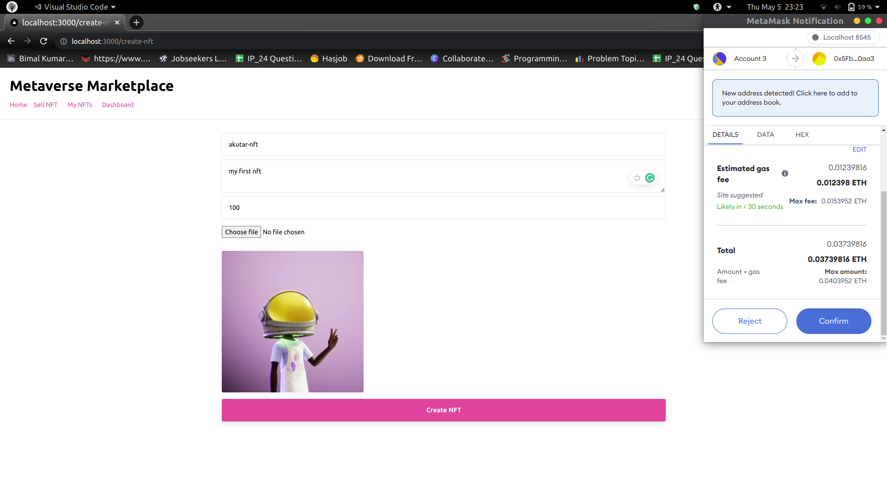
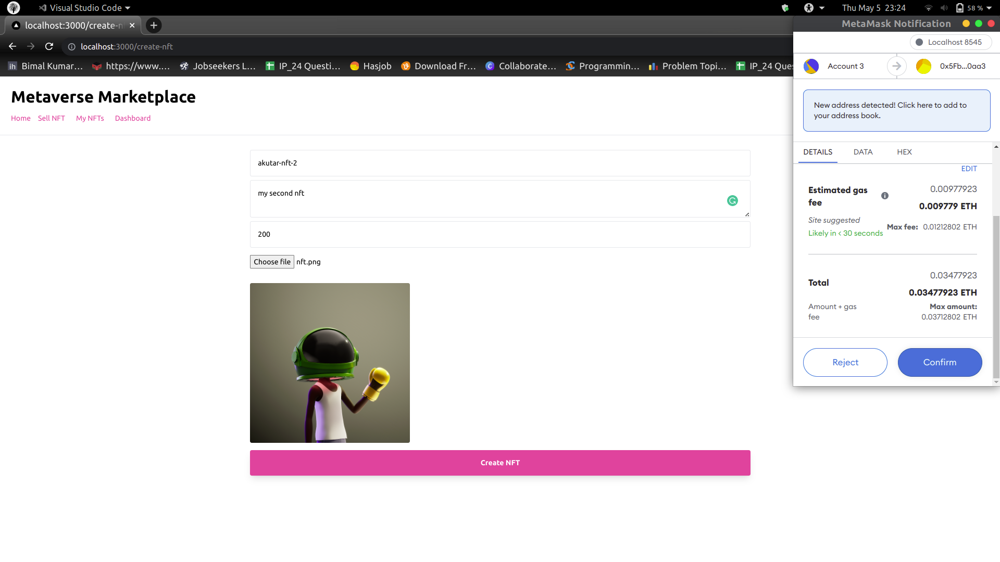
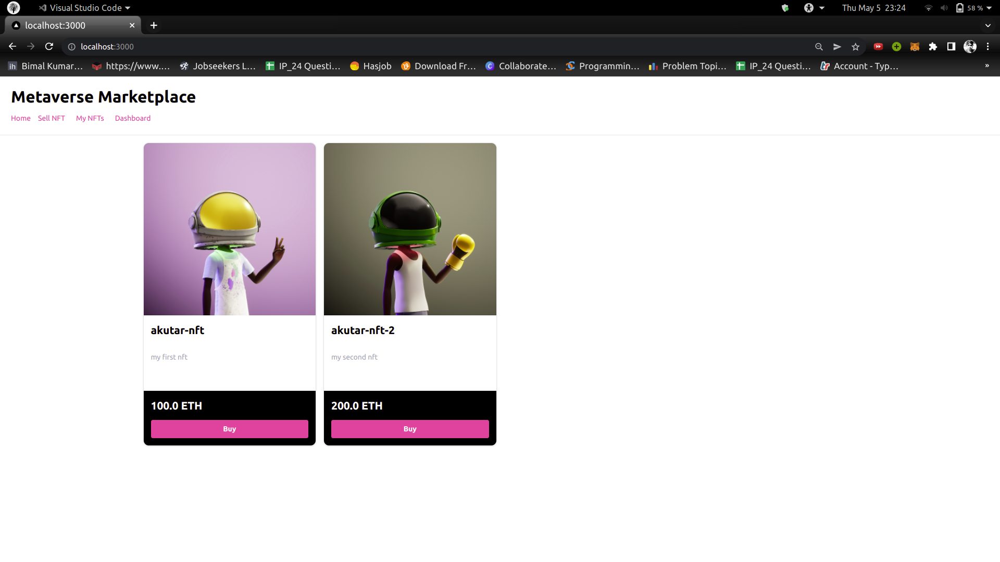
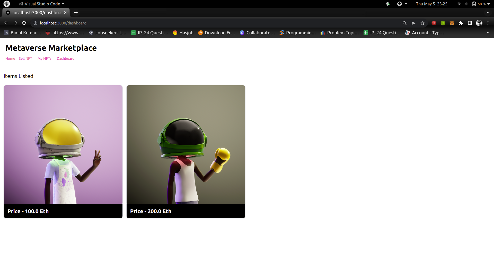
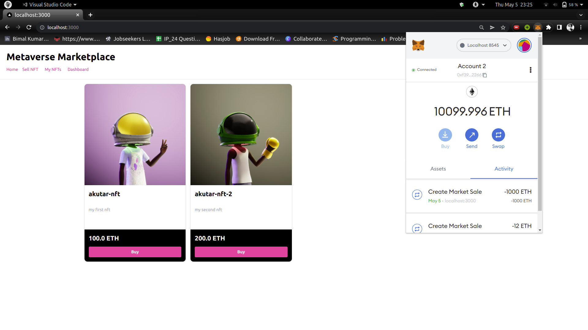
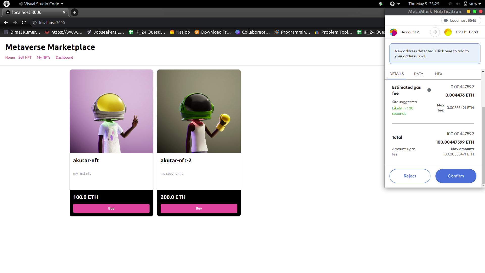

# Metaverse Marketplace

Metaverse Marketplace is a platform where users can buy and sell NFTs. A listing fee will be taken from the seller and transerred to the contract owner upon completion of transaction of any scale.

#### Connected to account 3 in the metamask wallet

#### Creating 1st NFT for sale

- #### charges gas fee and listingPrice

#### Creating 2nd NFT for sale

#### Homepage

#### Creator's Dashboard

#### Connected to account 2 in the metamask wallet

#### Bought akutar-nft from Account 2

- #### 100 ETH transfered from account 2 to account 3
